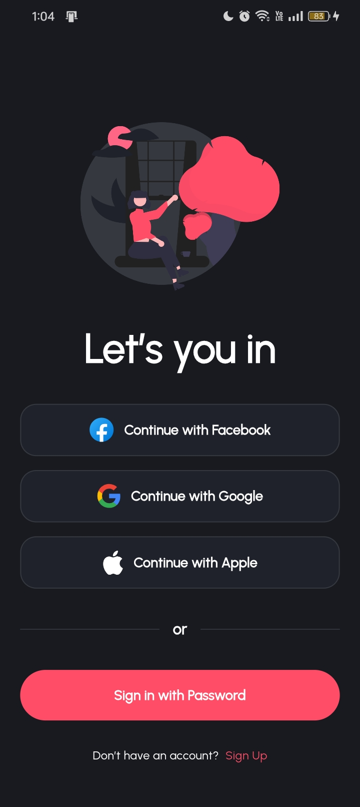
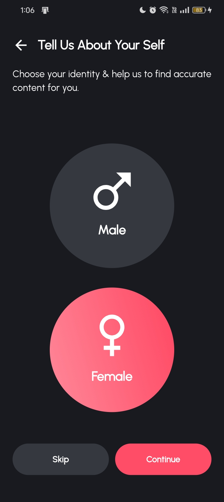
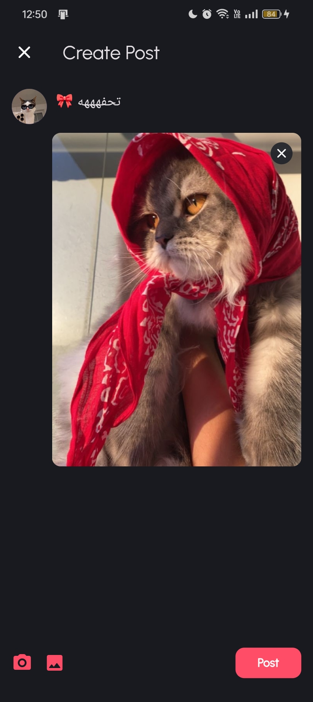
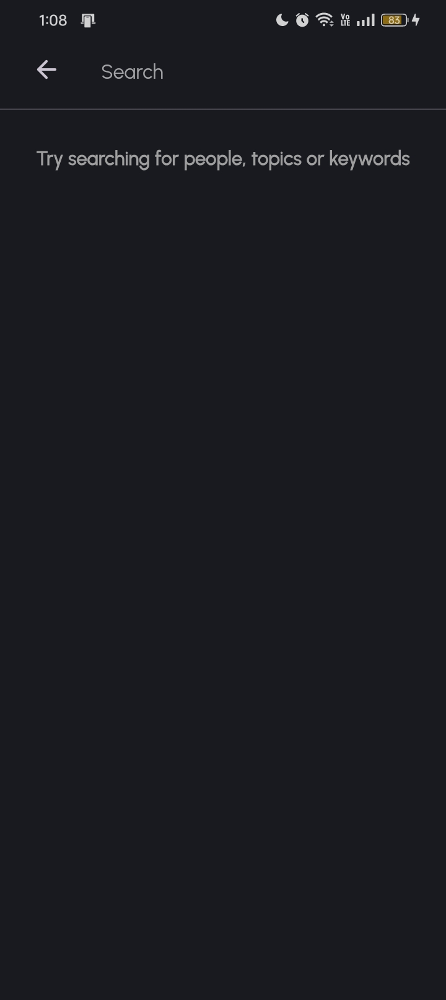
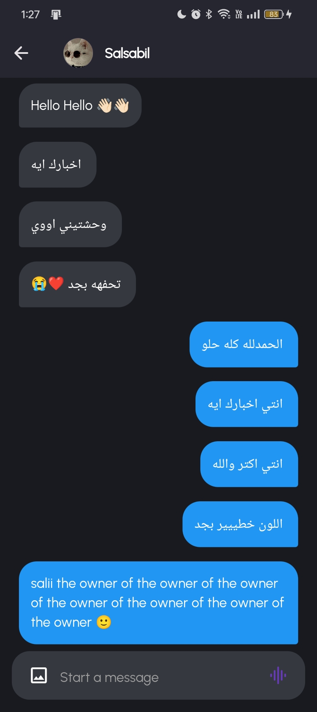

# Social Media Application 🌐🌐
- Welcome to our innovative Flutter social application! This application allows users to share their thoughts, as well as interact with others through comments, likes, and following 
  other users.
- Chat this feature-rich messaging platform allows users to connect and communicate seamlessly through text and images.
- The app is built using Flutter for the frontend and integrates with Firebase for backend services, including authentication, real-time database, and storage.

## ✨ Features
- Firebase Auth ( Email + Google + Facebook)
- Customize your profile.
- Share what you feel today.
- Post photo posts from camera or gallery.
    * Like posts.
    * Comment on posts.
- Search for users.
- Real-time messaging using Firebase Realtime Database for instant message delivery.
- Used Cubit to manage state
- other features (Coming Soon!)

## 🔌 Packages
- cloud_firestore
- firebase_auth
- firebase_core
- firebase_messaging
- firebase_storage
- flutter_facebook_auth
- google_sign_in
- dartz
- equatable
- flutter_bloc
- flutter_native_splash
- get_it
- persistent_bottom_nav_bar
- internet_connection_checker
- shared_preferences

  ## 📸 ScreenShots
| Social                                          | Application                                 |
| ------------------------------------------------| --------------------------------------------|
|       |   |
|       |   |
|       |   |
|       |   |
|       |  |
|      |  |
|      |  |
|      |  |
|      |  |
|      |  |
